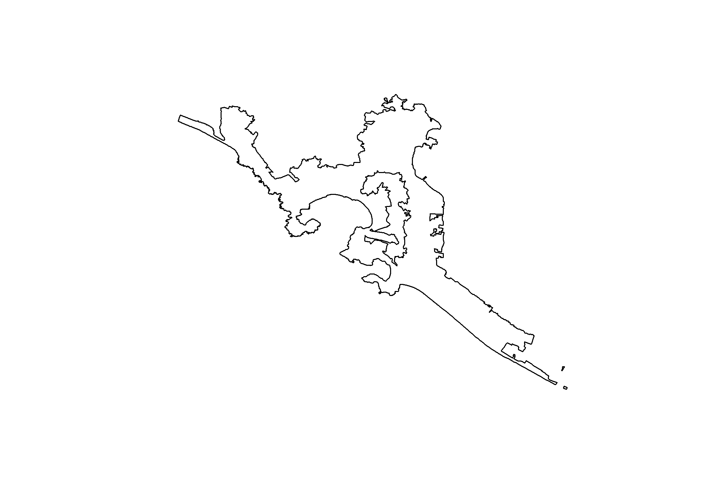
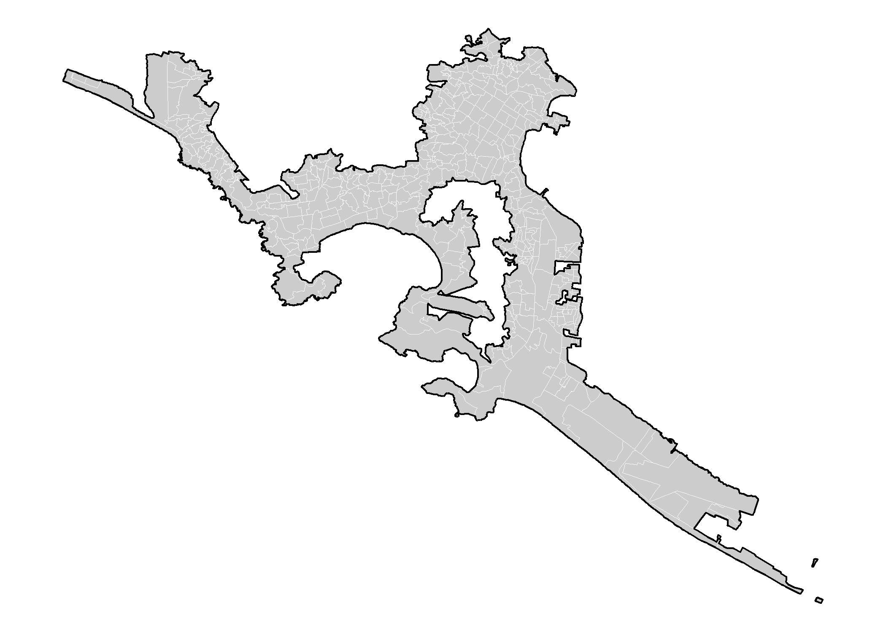
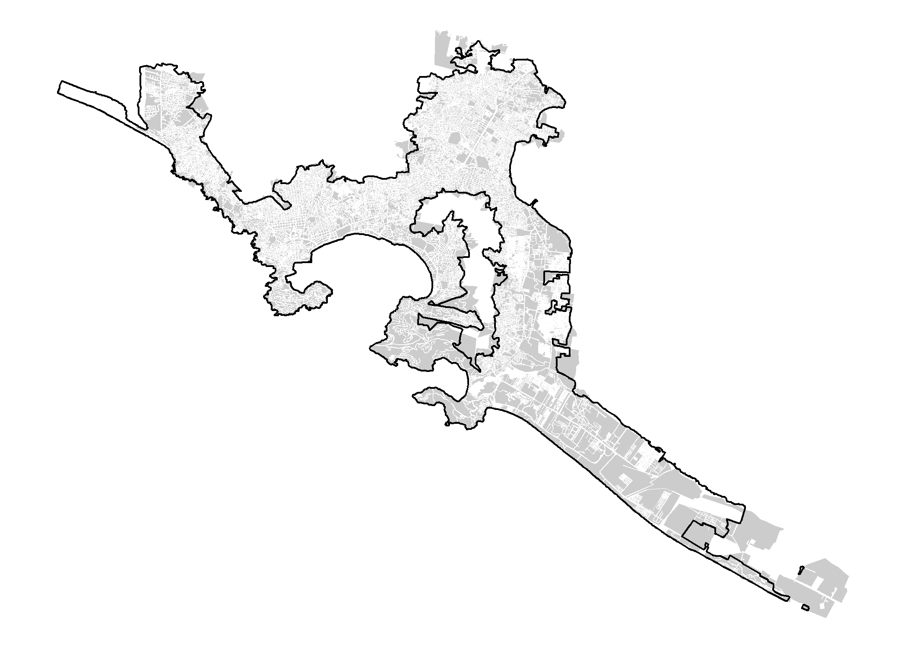

<!-- README.md is generated from README.Rmd. Please edit that file -->

# **rgeomex**

[](https://travis-ci.com/fdzul/rgeomex)
[](http://hits.dwyl.com/fdzul/rgeomex)

[](https://codecov.io/gh/fdzul/rgeomex?branch=master)

**rgeomex is a package developed in the department of prevention and
control of diseases transmitted by vector of the [Secretary of Health of
Veracruz](https://www.ssaver.gob.mx/) with collaboration of the
[CENAPRECE](https://www.gob.mx/salud/cenaprece) and
[INDRE](https://www.gob.mx/salud/acciones-y-programas/instituto-de-diagnostico-y-referencia-epidemiologicos-mision-vision-y-politica-de-calidad-181639?state=published)**

## **overview**

**rgeomex** is a package to provide spatial dataset (areal data)
available and published homepage of
[INE](https://pautas.ine.mx/transparencia/mapas/) and
[INEGI](https://www.inegi.org.mx/temas/mg). These spatial dataset are
useful for visualization and spatial analysis of diseases. The secondary
objective of the package is to provide spatial bases for the calculation
of dengue hotspots and their vectors. The package has six spatial
datasets.

-   **`blocks_ine20_mx`** spatial dataset containing polygon data of
    blocks from Mexico (INE 2020).
-   **`localities_inegi19_mx`** spatial dataset containing polygon data
    of localities from Mexico (INEGI 2019).
-   **`AGEB_inegi19_mx`** spatial dataset containing polygon data of
    AGEBs from Mexico (INEGI 2019).
-   **`AGEE_inegi19_mx`** spatial dataset containing polygon data of
    AGEE from Mexico (INEGI 2019).
-   **`AGEM_inegi19_mx`** spatial dataset containing polygon data of
    AGEM from Mexico (INEGI 2019).

## Installation

You can install the released version of rgeomex from
[CRAN](https://CRAN.R-project.org) with:

``` r
install.packages("rgeomex")
```

And the development version from [GitHub](https://github.com/) with:

``` r
# install.packages("devtools")
devtools::install_github("fdzul/rgeomex")
```

## Example

This is a basic example which shows how to solve a common problem:

``` r
library(magrittr)
library(sf)
#> Linking to GEOS 3.8.0, GDAL 3.0.4, PROJ 6.3.1
loc_acapulco <-  rgeomex::loc_inegi19_mx %>%
        dplyr::filter(NOMGEO %in% c(similiars::find_most_similar_string("Acapulco de Juarez", unique(NOMGEO))) &
                          AMBITO %in% c("Urbana"))
plot(sf::st_geometry(loc_acapulco))
```



``` r
ageb_acapulco <- rgeomex::AGEB_inegi_2019_a[loc_acapulco,]
#> although coordinates are longitude/latitude, st_intersects assumes that they are planar
head(ageb_acapulco)
#> Simple feature collection with 6 features and 9 fields
#> geometry type:  MULTIPOLYGON
#> dimension:      XY
#> bbox:           xmin: -99.95915 ymin: 16.81636 xmax: -99.84201 ymax: 16.89684
#> geographic CRS: WGS 84
#>       OBJECTID        CVEGEO CVE_ENT CVE_MUN CVE_LOC CVE_AGEB Ambito Shape_Leng
#> 18715    18715 1200100010405      12     001    0001     0405 Urbana   5259.950
#> 18716    18716 1200100012187      12     001    0001     2187 Urbana   3042.943
#> 18717    18717 1200100010496      12     001    0001     0496 Urbana   5651.284
#> 18718    18718 1200100010513      12     001    0001     0513 Urbana   9803.373
#> 18719    18719 1200100010528      12     001    0001     0528 Urbana   8486.585
#> 18720    18720 1200100012242      12     001    0001     2242 Urbana   2769.117
#>       Shape_Area                       geometry
#> 18715  1039839.0 MULTIPOLYGON (((-99.8626 16...
#> 18716   200872.4 MULTIPOLYGON (((-99.95233 1...
#> 18717  1199501.4 MULTIPOLYGON (((-99.91146 1...
#> 18718  1447090.3 MULTIPOLYGON (((-99.84338 1...
#> 18719  1549657.9 MULTIPOLYGON (((-99.85651 1...
#> 18720   215333.1 MULTIPOLYGON (((-99.95207 1...
ggplot2::ggplot()+
  ggplot2::geom_sf(data = ageb_acapulco,
                   fill = "gray80",
                   col = "white",
                   lwd = 0.1) +
  ggplot2::theme_void() +
  ggplot2::geom_sf(data = loc_acapulco,
                   fill = NA,
                   col = "black",
                   lwd = .5)
```



``` r
blocks_acapulco <- rbind(rgeomex::blocks_ine20_mx_a,
                         rgeomex::blocks_ine20_mx_b)[loc_acapulco,]
#> although coordinates are longitude/latitude, st_intersects assumes that they are planar
head(blocks_acapulco)
#> Simple feature collection with 6 features and 8 fields
#> geometry type:  POLYGON
#> dimension:      XY
#> bbox:           xmin: -99.95625 ymin: 16.8926 xmax: -99.95195 ymax: 16.89642
#> geographic CRS: WGS 84
#>          gid id entidad distrito municipio seccion localidad manzana
#> 479902 46791  5      12        4         1       1         1      63
#> 479903 46826 59      12        4         1       2         1      69
#> 479904 46792  9      12        4         1       1         1      65
#> 479905 46793  8      12        4         1       1         1      66
#> 479906 46763  2      12        4         1       1         1       1
#> 479907 46778 39      12        4         1       1         1      49
#>                              geometry
#> 479902 POLYGON ((-99.95295 16.8950...
#> 479903 POLYGON ((-99.95236 16.8964...
#> 479904 POLYGON ((-99.95318 16.8949...
#> 479905 POLYGON ((-99.95338 16.8948...
#> 479906 POLYGON ((-99.95425 16.8927...
#> 479907 POLYGON ((-99.95553 16.8943...

ggplot2::ggplot()+
  ggplot2::geom_sf(data = blocks_acapulco,
                   fill = "gray80",
                   col = "white",
                   lwd = 0.1) +
  ggplot2::theme_void() +
  ggplot2::geom_sf(data = loc_acapulco,
                   fill = NA,
                   col = "black",
                   lwd = .5)
```



## Authors

-   **Felipe Antonio Dzul Manzanilla** -**<https://github.com/fdzul>** -
    Packages developed in github:

    1.  [denhotspots](https://github.com/fdzul/denhotspots).
    2.  [boldenr](https://github.com/fdzul/boldenr).
    3.  [dendata](https://github.com/fdzul/dendata).
    4.  [deneggs](https://github.com/fdzul/deneggs).

-   **Fabián Correa Morales**

-   **Luis Hernández Herrera**

-   **Arturo Baez-Hernández**

-   **Evaristo Morales Ríos**

-   **Heron Huerta**

-   **Dorothy Dzul**

See also the list of
[contributors](https://github.com/fdzul/geomex/contributors) who
participated in this project.

## License

This project is licensed under the MIT License - see the
[LICENSE.md](LICENSE.md) file for details

## Inspiration

The package was inspired by the need to contribute toward making
decisions in the dengue prevention and control program, specifically
through the identification of dengue vector hotspots and use the
entomological information generated by the program.

## Getting help

If you encounter a clear bug, please file a minimal reproducible example
on [github](https://github.com/fdzul/rgeomex/issues). For questions and
other discussion, feel free to contact me (<felipe.dzul.m@gmail.com>)

------------------------------------------------------------------------

Please note that this project is released with a [Contributor Code of
Conduct](https://dplyr.tidyverse.org/CODE_OF_CONDUCT). By participating
in this project you agree to abide by its terms.
