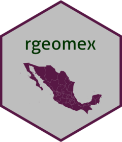

<!-- README.md is generated from README.Rmd. Please edit that file -->

# **rgeomex**

[](https://travis-ci.com/fdzul/rgeomex)
[](http://hits.dwyl.com/fdzul/fdzul/rgeomex)

[](https://codecov.io/gh/fdzul/rgeomex?branch=master)



**rgeomex** is a package developed in the
[CENAPRECE](https://www.gob.mx/salud/cenaprece) dengue prevention and
control program in collaboration with
[INDRE](https://www.gob.mx/salud/acciones-y-programas/instituto-de-diagnostico-y-referencia-epidemiologicos-mision-vision-y-politica-de-calidad-181639?state=published),
and the states of Veracruz and Yucatan.

## **overview**

Geographical datasets from the
[INEGI](https://www.inegi.org.mx/temas/mg) and
[INE](https://pautas.ine.mx/transparencia/mapas/) are available in the R
package **rgeomex**. Geographical dataset at various resolutions
(states, municipalities, localities, agebs, blocks, sectors, and
neighborhoods) constitute the majority of the package’s content.

**rgeomex** constitutes a transversal package of the **ETVerse** and
**IVAverse** initiatives. [rgeomex](https://fdzul.github.io/rgeomex/),
together with *denepikit*, *denhotspots*,
[deneggs](https://fdzul.github.io/deneggs/), and *dencontrol* packages,
constitute a universe of packages that make up the dengueverse of the
dengue prevention and control program in Mexico.

The package has six spatial datasets and functions for extract the AGEBs
(extract_ageb), blocks (extract_blocks), sectores (extract_sectores) &
localities (extract_locality).

- **`AGEB_inegi_2019_mx`** spatial dataset containing polygon data of
  AGEBs (Area Geostadística Basica) from Mexico (INEGI 2019). The urban
  AGEBs are split in two files.

<div id="mgiknfifwr" style="padding-left:0px;padding-right:0px;padding-top:10px;padding-bottom:10px;overflow-x:auto;overflow-y:auto;width:auto;height:auto;">
<style>#mgiknfifwr table {
  font-family: system-ui, 'Segoe UI', Roboto, Helvetica, Arial, sans-serif, 'Apple Color Emoji', 'Segoe UI Emoji', 'Segoe UI Symbol', 'Noto Color Emoji';
  -webkit-font-smoothing: antialiased;
  -moz-osx-font-smoothing: grayscale;
}
&#10;#mgiknfifwr thead, #mgiknfifwr tbody, #mgiknfifwr tfoot, #mgiknfifwr tr, #mgiknfifwr td, #mgiknfifwr th {
  border-style: none;
}
&#10;#mgiknfifwr p {
  margin: 0;
  padding: 0;
}
&#10;#mgiknfifwr .gt_table {
  display: table;
  border-collapse: collapse;
  line-height: normal;
  margin-left: auto;
  margin-right: auto;
  color: #333333;
  font-size: 16px;
  font-weight: normal;
  font-style: normal;
  background-color: #FFFFFF;
  width: auto;
  border-top-style: solid;
  border-top-width: 2px;
  border-top-color: #A8A8A8;
  border-right-style: none;
  border-right-width: 2px;
  border-right-color: #D3D3D3;
  border-bottom-style: solid;
  border-bottom-width: 2px;
  border-bottom-color: #A8A8A8;
  border-left-style: none;
  border-left-width: 2px;
  border-left-color: #D3D3D3;
}
&#10;#mgiknfifwr .gt_caption {
  padding-top: 4px;
  padding-bottom: 4px;
}
&#10;#mgiknfifwr .gt_title {
  color: #333333;
  font-size: 125%;
  font-weight: initial;
  padding-top: 4px;
  padding-bottom: 4px;
  padding-left: 5px;
  padding-right: 5px;
  border-bottom-color: #FFFFFF;
  border-bottom-width: 0;
}
&#10;#mgiknfifwr .gt_subtitle {
  color: #333333;
  font-size: 85%;
  font-weight: initial;
  padding-top: 3px;
  padding-bottom: 5px;
  padding-left: 5px;
  padding-right: 5px;
  border-top-color: #FFFFFF;
  border-top-width: 0;
}
&#10;#mgiknfifwr .gt_heading {
  background-color: #FFFFFF;
  text-align: center;
  border-bottom-color: #FFFFFF;
  border-left-style: none;
  border-left-width: 1px;
  border-left-color: #D3D3D3;
  border-right-style: none;
  border-right-width: 1px;
  border-right-color: #D3D3D3;
}
&#10;#mgiknfifwr .gt_bottom_border {
  border-bottom-style: solid;
  border-bottom-width: 2px;
  border-bottom-color: #D3D3D3;
}
&#10;#mgiknfifwr .gt_col_headings {
  border-top-style: solid;
  border-top-width: 2px;
  border-top-color: #D3D3D3;
  border-bottom-style: solid;
  border-bottom-width: 2px;
  border-bottom-color: #D3D3D3;
  border-left-style: none;
  border-left-width: 1px;
  border-left-color: #D3D3D3;
  border-right-style: none;
  border-right-width: 1px;
  border-right-color: #D3D3D3;
}
&#10;#mgiknfifwr .gt_col_heading {
  color: #333333;
  background-color: #FFFFFF;
  font-size: 100%;
  font-weight: normal;
  text-transform: inherit;
  border-left-style: none;
  border-left-width: 1px;
  border-left-color: #D3D3D3;
  border-right-style: none;
  border-right-width: 1px;
  border-right-color: #D3D3D3;
  vertical-align: bottom;
  padding-top: 5px;
  padding-bottom: 6px;
  padding-left: 5px;
  padding-right: 5px;
  overflow-x: hidden;
}
&#10;#mgiknfifwr .gt_column_spanner_outer {
  color: #333333;
  background-color: #FFFFFF;
  font-size: 100%;
  font-weight: normal;
  text-transform: inherit;
  padding-top: 0;
  padding-bottom: 0;
  padding-left: 4px;
  padding-right: 4px;
}
&#10;#mgiknfifwr .gt_column_spanner_outer:first-child {
  padding-left: 0;
}
&#10;#mgiknfifwr .gt_column_spanner_outer:last-child {
  padding-right: 0;
}
&#10;#mgiknfifwr .gt_column_spanner {
  border-bottom-style: solid;
  border-bottom-width: 2px;
  border-bottom-color: #D3D3D3;
  vertical-align: bottom;
  padding-top: 5px;
  padding-bottom: 5px;
  overflow-x: hidden;
  display: inline-block;
  width: 100%;
}
&#10;#mgiknfifwr .gt_spanner_row {
  border-bottom-style: hidden;
}
&#10;#mgiknfifwr .gt_group_heading {
  padding-top: 8px;
  padding-bottom: 8px;
  padding-left: 5px;
  padding-right: 5px;
  color: #333333;
  background-color: #FFFFFF;
  font-size: 100%;
  font-weight: initial;
  text-transform: inherit;
  border-top-style: solid;
  border-top-width: 2px;
  border-top-color: #D3D3D3;
  border-bottom-style: solid;
  border-bottom-width: 2px;
  border-bottom-color: #D3D3D3;
  border-left-style: none;
  border-left-width: 1px;
  border-left-color: #D3D3D3;
  border-right-style: none;
  border-right-width: 1px;
  border-right-color: #D3D3D3;
  vertical-align: middle;
  text-align: left;
}
&#10;#mgiknfifwr .gt_empty_group_heading {
  padding: 0.5px;
  color: #333333;
  background-color: #FFFFFF;
  font-size: 100%;
  font-weight: initial;
  border-top-style: solid;
  border-top-width: 2px;
  border-top-color: #D3D3D3;
  border-bottom-style: solid;
  border-bottom-width: 2px;
  border-bottom-color: #D3D3D3;
  vertical-align: middle;
}
&#10;#mgiknfifwr .gt_from_md > :first-child {
  margin-top: 0;
}
&#10;#mgiknfifwr .gt_from_md > :last-child {
  margin-bottom: 0;
}
&#10;#mgiknfifwr .gt_row {
  padding-top: 8px;
  padding-bottom: 8px;
  padding-left: 5px;
  padding-right: 5px;
  margin: 10px;
  border-top-style: solid;
  border-top-width: 1px;
  border-top-color: #D3D3D3;
  border-left-style: none;
  border-left-width: 1px;
  border-left-color: #D3D3D3;
  border-right-style: none;
  border-right-width: 1px;
  border-right-color: #D3D3D3;
  vertical-align: middle;
  overflow-x: hidden;
}
&#10;#mgiknfifwr .gt_stub {
  color: #333333;
  background-color: #FFFFFF;
  font-size: 100%;
  font-weight: initial;
  text-transform: inherit;
  border-right-style: solid;
  border-right-width: 2px;
  border-right-color: #D3D3D3;
  padding-left: 5px;
  padding-right: 5px;
}
&#10;#mgiknfifwr .gt_stub_row_group {
  color: #333333;
  background-color: #FFFFFF;
  font-size: 100%;
  font-weight: initial;
  text-transform: inherit;
  border-right-style: solid;
  border-right-width: 2px;
  border-right-color: #D3D3D3;
  padding-left: 5px;
  padding-right: 5px;
  vertical-align: top;
}
&#10;#mgiknfifwr .gt_row_group_first td {
  border-top-width: 2px;
}
&#10;#mgiknfifwr .gt_row_group_first th {
  border-top-width: 2px;
}
&#10;#mgiknfifwr .gt_summary_row {
  color: #333333;
  background-color: #FFFFFF;
  text-transform: inherit;
  padding-top: 8px;
  padding-bottom: 8px;
  padding-left: 5px;
  padding-right: 5px;
}
&#10;#mgiknfifwr .gt_first_summary_row {
  border-top-style: solid;
  border-top-color: #D3D3D3;
}
&#10;#mgiknfifwr .gt_first_summary_row.thick {
  border-top-width: 2px;
}
&#10;#mgiknfifwr .gt_last_summary_row {
  padding-top: 8px;
  padding-bottom: 8px;
  padding-left: 5px;
  padding-right: 5px;
  border-bottom-style: solid;
  border-bottom-width: 2px;
  border-bottom-color: #D3D3D3;
}
&#10;#mgiknfifwr .gt_grand_summary_row {
  color: #333333;
  background-color: #FFFFFF;
  text-transform: inherit;
  padding-top: 8px;
  padding-bottom: 8px;
  padding-left: 5px;
  padding-right: 5px;
}
&#10;#mgiknfifwr .gt_first_grand_summary_row {
  padding-top: 8px;
  padding-bottom: 8px;
  padding-left: 5px;
  padding-right: 5px;
  border-top-style: double;
  border-top-width: 6px;
  border-top-color: #D3D3D3;
}
&#10;#mgiknfifwr .gt_last_grand_summary_row_top {
  padding-top: 8px;
  padding-bottom: 8px;
  padding-left: 5px;
  padding-right: 5px;
  border-bottom-style: double;
  border-bottom-width: 6px;
  border-bottom-color: #D3D3D3;
}
&#10;#mgiknfifwr .gt_striped {
  background-color: rgba(128, 128, 128, 0.05);
}
&#10;#mgiknfifwr .gt_table_body {
  border-top-style: solid;
  border-top-width: 2px;
  border-top-color: #D3D3D3;
  border-bottom-style: solid;
  border-bottom-width: 2px;
  border-bottom-color: #D3D3D3;
}
&#10;#mgiknfifwr .gt_footnotes {
  color: #333333;
  background-color: #FFFFFF;
  border-bottom-style: none;
  border-bottom-width: 2px;
  border-bottom-color: #D3D3D3;
  border-left-style: none;
  border-left-width: 2px;
  border-left-color: #D3D3D3;
  border-right-style: none;
  border-right-width: 2px;
  border-right-color: #D3D3D3;
}
&#10;#mgiknfifwr .gt_footnote {
  margin: 0px;
  font-size: 90%;
  padding-top: 4px;
  padding-bottom: 4px;
  padding-left: 5px;
  padding-right: 5px;
}
&#10;#mgiknfifwr .gt_sourcenotes {
  color: #333333;
  background-color: #FFFFFF;
  border-bottom-style: none;
  border-bottom-width: 2px;
  border-bottom-color: #D3D3D3;
  border-left-style: none;
  border-left-width: 2px;
  border-left-color: #D3D3D3;
  border-right-style: none;
  border-right-width: 2px;
  border-right-color: #D3D3D3;
}
&#10;#mgiknfifwr .gt_sourcenote {
  font-size: 90%;
  padding-top: 4px;
  padding-bottom: 4px;
  padding-left: 5px;
  padding-right: 5px;
}
&#10;#mgiknfifwr .gt_left {
  text-align: left;
}
&#10;#mgiknfifwr .gt_center {
  text-align: center;
}
&#10;#mgiknfifwr .gt_right {
  text-align: right;
  font-variant-numeric: tabular-nums;
}
&#10;#mgiknfifwr .gt_font_normal {
  font-weight: normal;
}
&#10;#mgiknfifwr .gt_font_bold {
  font-weight: bold;
}
&#10;#mgiknfifwr .gt_font_italic {
  font-style: italic;
}
&#10;#mgiknfifwr .gt_super {
  font-size: 65%;
}
&#10;#mgiknfifwr .gt_footnote_marks {
  font-size: 75%;
  vertical-align: 0.4em;
  position: initial;
}
&#10;#mgiknfifwr .gt_asterisk {
  font-size: 100%;
  vertical-align: 0;
}
&#10;#mgiknfifwr .gt_indent_1 {
  text-indent: 5px;
}
&#10;#mgiknfifwr .gt_indent_2 {
  text-indent: 10px;
}
&#10;#mgiknfifwr .gt_indent_3 {
  text-indent: 15px;
}
&#10;#mgiknfifwr .gt_indent_4 {
  text-indent: 20px;
}
&#10;#mgiknfifwr .gt_indent_5 {
  text-indent: 25px;
}
</style>
<table class="gt_table" data-quarto-disable-processing="false" data-quarto-bootstrap="false">
  <thead>
    &#10;    <tr class="gt_col_headings">
      <th class="gt_col_heading gt_columns_bottom_border gt_left" rowspan="1" colspan="1" scope="col" id="dataset">dataset</th>
      <th class="gt_col_heading gt_columns_bottom_border gt_right" rowspan="1" colspan="1" scope="col" id="id_states">id_states</th>
    </tr>
  </thead>
  <tbody class="gt_table_body">
    <tr><td headers="dataset" class="gt_row gt_left">rgeomex::AGEB_inegi_2019_a</td>
<td headers="id_states" class="gt_row gt_right">01-16</td></tr>
    <tr><td headers="dataset" class="gt_row gt_left">rgeomex::AGEB_inegi_2019_b</td>
<td headers="id_states" class="gt_row gt_right">17-32</td></tr>
  </tbody>
  &#10;  
</table>
</div>

- **`blocks_ine20_mx`** spatial dataset containing polygon data of
  blocks from Mexico (INE 2020). The blocks of the urban cities are
  split in five files from a to e.

<div id="vsywmbccqt" style="padding-left:0px;padding-right:0px;padding-top:10px;padding-bottom:10px;overflow-x:auto;overflow-y:auto;width:auto;height:auto;">
<style>#vsywmbccqt table {
  font-family: system-ui, 'Segoe UI', Roboto, Helvetica, Arial, sans-serif, 'Apple Color Emoji', 'Segoe UI Emoji', 'Segoe UI Symbol', 'Noto Color Emoji';
  -webkit-font-smoothing: antialiased;
  -moz-osx-font-smoothing: grayscale;
}
&#10;#vsywmbccqt thead, #vsywmbccqt tbody, #vsywmbccqt tfoot, #vsywmbccqt tr, #vsywmbccqt td, #vsywmbccqt th {
  border-style: none;
}
&#10;#vsywmbccqt p {
  margin: 0;
  padding: 0;
}
&#10;#vsywmbccqt .gt_table {
  display: table;
  border-collapse: collapse;
  line-height: normal;
  margin-left: auto;
  margin-right: auto;
  color: #333333;
  font-size: 16px;
  font-weight: normal;
  font-style: normal;
  background-color: #FFFFFF;
  width: auto;
  border-top-style: solid;
  border-top-width: 2px;
  border-top-color: #A8A8A8;
  border-right-style: none;
  border-right-width: 2px;
  border-right-color: #D3D3D3;
  border-bottom-style: solid;
  border-bottom-width: 2px;
  border-bottom-color: #A8A8A8;
  border-left-style: none;
  border-left-width: 2px;
  border-left-color: #D3D3D3;
}
&#10;#vsywmbccqt .gt_caption {
  padding-top: 4px;
  padding-bottom: 4px;
}
&#10;#vsywmbccqt .gt_title {
  color: #333333;
  font-size: 125%;
  font-weight: initial;
  padding-top: 4px;
  padding-bottom: 4px;
  padding-left: 5px;
  padding-right: 5px;
  border-bottom-color: #FFFFFF;
  border-bottom-width: 0;
}
&#10;#vsywmbccqt .gt_subtitle {
  color: #333333;
  font-size: 85%;
  font-weight: initial;
  padding-top: 3px;
  padding-bottom: 5px;
  padding-left: 5px;
  padding-right: 5px;
  border-top-color: #FFFFFF;
  border-top-width: 0;
}
&#10;#vsywmbccqt .gt_heading {
  background-color: #FFFFFF;
  text-align: center;
  border-bottom-color: #FFFFFF;
  border-left-style: none;
  border-left-width: 1px;
  border-left-color: #D3D3D3;
  border-right-style: none;
  border-right-width: 1px;
  border-right-color: #D3D3D3;
}
&#10;#vsywmbccqt .gt_bottom_border {
  border-bottom-style: solid;
  border-bottom-width: 2px;
  border-bottom-color: #D3D3D3;
}
&#10;#vsywmbccqt .gt_col_headings {
  border-top-style: solid;
  border-top-width: 2px;
  border-top-color: #D3D3D3;
  border-bottom-style: solid;
  border-bottom-width: 2px;
  border-bottom-color: #D3D3D3;
  border-left-style: none;
  border-left-width: 1px;
  border-left-color: #D3D3D3;
  border-right-style: none;
  border-right-width: 1px;
  border-right-color: #D3D3D3;
}
&#10;#vsywmbccqt .gt_col_heading {
  color: #333333;
  background-color: #FFFFFF;
  font-size: 100%;
  font-weight: normal;
  text-transform: inherit;
  border-left-style: none;
  border-left-width: 1px;
  border-left-color: #D3D3D3;
  border-right-style: none;
  border-right-width: 1px;
  border-right-color: #D3D3D3;
  vertical-align: bottom;
  padding-top: 5px;
  padding-bottom: 6px;
  padding-left: 5px;
  padding-right: 5px;
  overflow-x: hidden;
}
&#10;#vsywmbccqt .gt_column_spanner_outer {
  color: #333333;
  background-color: #FFFFFF;
  font-size: 100%;
  font-weight: normal;
  text-transform: inherit;
  padding-top: 0;
  padding-bottom: 0;
  padding-left: 4px;
  padding-right: 4px;
}
&#10;#vsywmbccqt .gt_column_spanner_outer:first-child {
  padding-left: 0;
}
&#10;#vsywmbccqt .gt_column_spanner_outer:last-child {
  padding-right: 0;
}
&#10;#vsywmbccqt .gt_column_spanner {
  border-bottom-style: solid;
  border-bottom-width: 2px;
  border-bottom-color: #D3D3D3;
  vertical-align: bottom;
  padding-top: 5px;
  padding-bottom: 5px;
  overflow-x: hidden;
  display: inline-block;
  width: 100%;
}
&#10;#vsywmbccqt .gt_spanner_row {
  border-bottom-style: hidden;
}
&#10;#vsywmbccqt .gt_group_heading {
  padding-top: 8px;
  padding-bottom: 8px;
  padding-left: 5px;
  padding-right: 5px;
  color: #333333;
  background-color: #FFFFFF;
  font-size: 100%;
  font-weight: initial;
  text-transform: inherit;
  border-top-style: solid;
  border-top-width: 2px;
  border-top-color: #D3D3D3;
  border-bottom-style: solid;
  border-bottom-width: 2px;
  border-bottom-color: #D3D3D3;
  border-left-style: none;
  border-left-width: 1px;
  border-left-color: #D3D3D3;
  border-right-style: none;
  border-right-width: 1px;
  border-right-color: #D3D3D3;
  vertical-align: middle;
  text-align: left;
}
&#10;#vsywmbccqt .gt_empty_group_heading {
  padding: 0.5px;
  color: #333333;
  background-color: #FFFFFF;
  font-size: 100%;
  font-weight: initial;
  border-top-style: solid;
  border-top-width: 2px;
  border-top-color: #D3D3D3;
  border-bottom-style: solid;
  border-bottom-width: 2px;
  border-bottom-color: #D3D3D3;
  vertical-align: middle;
}
&#10;#vsywmbccqt .gt_from_md > :first-child {
  margin-top: 0;
}
&#10;#vsywmbccqt .gt_from_md > :last-child {
  margin-bottom: 0;
}
&#10;#vsywmbccqt .gt_row {
  padding-top: 8px;
  padding-bottom: 8px;
  padding-left: 5px;
  padding-right: 5px;
  margin: 10px;
  border-top-style: solid;
  border-top-width: 1px;
  border-top-color: #D3D3D3;
  border-left-style: none;
  border-left-width: 1px;
  border-left-color: #D3D3D3;
  border-right-style: none;
  border-right-width: 1px;
  border-right-color: #D3D3D3;
  vertical-align: middle;
  overflow-x: hidden;
}
&#10;#vsywmbccqt .gt_stub {
  color: #333333;
  background-color: #FFFFFF;
  font-size: 100%;
  font-weight: initial;
  text-transform: inherit;
  border-right-style: solid;
  border-right-width: 2px;
  border-right-color: #D3D3D3;
  padding-left: 5px;
  padding-right: 5px;
}
&#10;#vsywmbccqt .gt_stub_row_group {
  color: #333333;
  background-color: #FFFFFF;
  font-size: 100%;
  font-weight: initial;
  text-transform: inherit;
  border-right-style: solid;
  border-right-width: 2px;
  border-right-color: #D3D3D3;
  padding-left: 5px;
  padding-right: 5px;
  vertical-align: top;
}
&#10;#vsywmbccqt .gt_row_group_first td {
  border-top-width: 2px;
}
&#10;#vsywmbccqt .gt_row_group_first th {
  border-top-width: 2px;
}
&#10;#vsywmbccqt .gt_summary_row {
  color: #333333;
  background-color: #FFFFFF;
  text-transform: inherit;
  padding-top: 8px;
  padding-bottom: 8px;
  padding-left: 5px;
  padding-right: 5px;
}
&#10;#vsywmbccqt .gt_first_summary_row {
  border-top-style: solid;
  border-top-color: #D3D3D3;
}
&#10;#vsywmbccqt .gt_first_summary_row.thick {
  border-top-width: 2px;
}
&#10;#vsywmbccqt .gt_last_summary_row {
  padding-top: 8px;
  padding-bottom: 8px;
  padding-left: 5px;
  padding-right: 5px;
  border-bottom-style: solid;
  border-bottom-width: 2px;
  border-bottom-color: #D3D3D3;
}
&#10;#vsywmbccqt .gt_grand_summary_row {
  color: #333333;
  background-color: #FFFFFF;
  text-transform: inherit;
  padding-top: 8px;
  padding-bottom: 8px;
  padding-left: 5px;
  padding-right: 5px;
}
&#10;#vsywmbccqt .gt_first_grand_summary_row {
  padding-top: 8px;
  padding-bottom: 8px;
  padding-left: 5px;
  padding-right: 5px;
  border-top-style: double;
  border-top-width: 6px;
  border-top-color: #D3D3D3;
}
&#10;#vsywmbccqt .gt_last_grand_summary_row_top {
  padding-top: 8px;
  padding-bottom: 8px;
  padding-left: 5px;
  padding-right: 5px;
  border-bottom-style: double;
  border-bottom-width: 6px;
  border-bottom-color: #D3D3D3;
}
&#10;#vsywmbccqt .gt_striped {
  background-color: rgba(128, 128, 128, 0.05);
}
&#10;#vsywmbccqt .gt_table_body {
  border-top-style: solid;
  border-top-width: 2px;
  border-top-color: #D3D3D3;
  border-bottom-style: solid;
  border-bottom-width: 2px;
  border-bottom-color: #D3D3D3;
}
&#10;#vsywmbccqt .gt_footnotes {
  color: #333333;
  background-color: #FFFFFF;
  border-bottom-style: none;
  border-bottom-width: 2px;
  border-bottom-color: #D3D3D3;
  border-left-style: none;
  border-left-width: 2px;
  border-left-color: #D3D3D3;
  border-right-style: none;
  border-right-width: 2px;
  border-right-color: #D3D3D3;
}
&#10;#vsywmbccqt .gt_footnote {
  margin: 0px;
  font-size: 90%;
  padding-top: 4px;
  padding-bottom: 4px;
  padding-left: 5px;
  padding-right: 5px;
}
&#10;#vsywmbccqt .gt_sourcenotes {
  color: #333333;
  background-color: #FFFFFF;
  border-bottom-style: none;
  border-bottom-width: 2px;
  border-bottom-color: #D3D3D3;
  border-left-style: none;
  border-left-width: 2px;
  border-left-color: #D3D3D3;
  border-right-style: none;
  border-right-width: 2px;
  border-right-color: #D3D3D3;
}
&#10;#vsywmbccqt .gt_sourcenote {
  font-size: 90%;
  padding-top: 4px;
  padding-bottom: 4px;
  padding-left: 5px;
  padding-right: 5px;
}
&#10;#vsywmbccqt .gt_left {
  text-align: left;
}
&#10;#vsywmbccqt .gt_center {
  text-align: center;
}
&#10;#vsywmbccqt .gt_right {
  text-align: right;
  font-variant-numeric: tabular-nums;
}
&#10;#vsywmbccqt .gt_font_normal {
  font-weight: normal;
}
&#10;#vsywmbccqt .gt_font_bold {
  font-weight: bold;
}
&#10;#vsywmbccqt .gt_font_italic {
  font-style: italic;
}
&#10;#vsywmbccqt .gt_super {
  font-size: 65%;
}
&#10;#vsywmbccqt .gt_footnote_marks {
  font-size: 75%;
  vertical-align: 0.4em;
  position: initial;
}
&#10;#vsywmbccqt .gt_asterisk {
  font-size: 100%;
  vertical-align: 0;
}
&#10;#vsywmbccqt .gt_indent_1 {
  text-indent: 5px;
}
&#10;#vsywmbccqt .gt_indent_2 {
  text-indent: 10px;
}
&#10;#vsywmbccqt .gt_indent_3 {
  text-indent: 15px;
}
&#10;#vsywmbccqt .gt_indent_4 {
  text-indent: 20px;
}
&#10;#vsywmbccqt .gt_indent_5 {
  text-indent: 25px;
}
</style>
<table class="gt_table" data-quarto-disable-processing="false" data-quarto-bootstrap="false">
  <thead>
    &#10;    <tr class="gt_col_headings">
      <th class="gt_col_heading gt_columns_bottom_border gt_left" rowspan="1" colspan="1" scope="col" id="dataset">dataset</th>
      <th class="gt_col_heading gt_columns_bottom_border gt_right" rowspan="1" colspan="1" scope="col" id="id_states">id_states</th>
    </tr>
  </thead>
  <tbody class="gt_table_body">
    <tr><td headers="dataset" class="gt_row gt_left">blocks_ine20_mx_a</td>
<td headers="id_states" class="gt_row gt_right">1-10</td></tr>
    <tr><td headers="dataset" class="gt_row gt_left">blocks_ine20_mx_b</td>
<td headers="id_states" class="gt_row gt_right">11-14</td></tr>
    <tr><td headers="dataset" class="gt_row gt_left">blocks_ine20_mx_c</td>
<td headers="id_states" class="gt_row gt_right">15-19</td></tr>
    <tr><td headers="dataset" class="gt_row gt_left">blocks_ine20_mx_d</td>
<td headers="id_states" class="gt_row gt_right">20-25</td></tr>
    <tr><td headers="dataset" class="gt_row gt_left">blocks_ine20_mx_e</td>
<td headers="id_states" class="gt_row gt_right">26-32</td></tr>
  </tbody>
  &#10;  
</table>
</div>

- **`sectores_ine20_mx`** spatial dataset containing polygon data
  sectores INE from Mexico.

<div id="oapsdmteka" style="padding-left:0px;padding-right:0px;padding-top:10px;padding-bottom:10px;overflow-x:auto;overflow-y:auto;width:auto;height:auto;">
<style>#oapsdmteka table {
  font-family: system-ui, 'Segoe UI', Roboto, Helvetica, Arial, sans-serif, 'Apple Color Emoji', 'Segoe UI Emoji', 'Segoe UI Symbol', 'Noto Color Emoji';
  -webkit-font-smoothing: antialiased;
  -moz-osx-font-smoothing: grayscale;
}
&#10;#oapsdmteka thead, #oapsdmteka tbody, #oapsdmteka tfoot, #oapsdmteka tr, #oapsdmteka td, #oapsdmteka th {
  border-style: none;
}
&#10;#oapsdmteka p {
  margin: 0;
  padding: 0;
}
&#10;#oapsdmteka .gt_table {
  display: table;
  border-collapse: collapse;
  line-height: normal;
  margin-left: auto;
  margin-right: auto;
  color: #333333;
  font-size: 16px;
  font-weight: normal;
  font-style: normal;
  background-color: #FFFFFF;
  width: auto;
  border-top-style: solid;
  border-top-width: 2px;
  border-top-color: #A8A8A8;
  border-right-style: none;
  border-right-width: 2px;
  border-right-color: #D3D3D3;
  border-bottom-style: solid;
  border-bottom-width: 2px;
  border-bottom-color: #A8A8A8;
  border-left-style: none;
  border-left-width: 2px;
  border-left-color: #D3D3D3;
}
&#10;#oapsdmteka .gt_caption {
  padding-top: 4px;
  padding-bottom: 4px;
}
&#10;#oapsdmteka .gt_title {
  color: #333333;
  font-size: 125%;
  font-weight: initial;
  padding-top: 4px;
  padding-bottom: 4px;
  padding-left: 5px;
  padding-right: 5px;
  border-bottom-color: #FFFFFF;
  border-bottom-width: 0;
}
&#10;#oapsdmteka .gt_subtitle {
  color: #333333;
  font-size: 85%;
  font-weight: initial;
  padding-top: 3px;
  padding-bottom: 5px;
  padding-left: 5px;
  padding-right: 5px;
  border-top-color: #FFFFFF;
  border-top-width: 0;
}
&#10;#oapsdmteka .gt_heading {
  background-color: #FFFFFF;
  text-align: center;
  border-bottom-color: #FFFFFF;
  border-left-style: none;
  border-left-width: 1px;
  border-left-color: #D3D3D3;
  border-right-style: none;
  border-right-width: 1px;
  border-right-color: #D3D3D3;
}
&#10;#oapsdmteka .gt_bottom_border {
  border-bottom-style: solid;
  border-bottom-width: 2px;
  border-bottom-color: #D3D3D3;
}
&#10;#oapsdmteka .gt_col_headings {
  border-top-style: solid;
  border-top-width: 2px;
  border-top-color: #D3D3D3;
  border-bottom-style: solid;
  border-bottom-width: 2px;
  border-bottom-color: #D3D3D3;
  border-left-style: none;
  border-left-width: 1px;
  border-left-color: #D3D3D3;
  border-right-style: none;
  border-right-width: 1px;
  border-right-color: #D3D3D3;
}
&#10;#oapsdmteka .gt_col_heading {
  color: #333333;
  background-color: #FFFFFF;
  font-size: 100%;
  font-weight: normal;
  text-transform: inherit;
  border-left-style: none;
  border-left-width: 1px;
  border-left-color: #D3D3D3;
  border-right-style: none;
  border-right-width: 1px;
  border-right-color: #D3D3D3;
  vertical-align: bottom;
  padding-top: 5px;
  padding-bottom: 6px;
  padding-left: 5px;
  padding-right: 5px;
  overflow-x: hidden;
}
&#10;#oapsdmteka .gt_column_spanner_outer {
  color: #333333;
  background-color: #FFFFFF;
  font-size: 100%;
  font-weight: normal;
  text-transform: inherit;
  padding-top: 0;
  padding-bottom: 0;
  padding-left: 4px;
  padding-right: 4px;
}
&#10;#oapsdmteka .gt_column_spanner_outer:first-child {
  padding-left: 0;
}
&#10;#oapsdmteka .gt_column_spanner_outer:last-child {
  padding-right: 0;
}
&#10;#oapsdmteka .gt_column_spanner {
  border-bottom-style: solid;
  border-bottom-width: 2px;
  border-bottom-color: #D3D3D3;
  vertical-align: bottom;
  padding-top: 5px;
  padding-bottom: 5px;
  overflow-x: hidden;
  display: inline-block;
  width: 100%;
}
&#10;#oapsdmteka .gt_spanner_row {
  border-bottom-style: hidden;
}
&#10;#oapsdmteka .gt_group_heading {
  padding-top: 8px;
  padding-bottom: 8px;
  padding-left: 5px;
  padding-right: 5px;
  color: #333333;
  background-color: #FFFFFF;
  font-size: 100%;
  font-weight: initial;
  text-transform: inherit;
  border-top-style: solid;
  border-top-width: 2px;
  border-top-color: #D3D3D3;
  border-bottom-style: solid;
  border-bottom-width: 2px;
  border-bottom-color: #D3D3D3;
  border-left-style: none;
  border-left-width: 1px;
  border-left-color: #D3D3D3;
  border-right-style: none;
  border-right-width: 1px;
  border-right-color: #D3D3D3;
  vertical-align: middle;
  text-align: left;
}
&#10;#oapsdmteka .gt_empty_group_heading {
  padding: 0.5px;
  color: #333333;
  background-color: #FFFFFF;
  font-size: 100%;
  font-weight: initial;
  border-top-style: solid;
  border-top-width: 2px;
  border-top-color: #D3D3D3;
  border-bottom-style: solid;
  border-bottom-width: 2px;
  border-bottom-color: #D3D3D3;
  vertical-align: middle;
}
&#10;#oapsdmteka .gt_from_md > :first-child {
  margin-top: 0;
}
&#10;#oapsdmteka .gt_from_md > :last-child {
  margin-bottom: 0;
}
&#10;#oapsdmteka .gt_row {
  padding-top: 8px;
  padding-bottom: 8px;
  padding-left: 5px;
  padding-right: 5px;
  margin: 10px;
  border-top-style: solid;
  border-top-width: 1px;
  border-top-color: #D3D3D3;
  border-left-style: none;
  border-left-width: 1px;
  border-left-color: #D3D3D3;
  border-right-style: none;
  border-right-width: 1px;
  border-right-color: #D3D3D3;
  vertical-align: middle;
  overflow-x: hidden;
}
&#10;#oapsdmteka .gt_stub {
  color: #333333;
  background-color: #FFFFFF;
  font-size: 100%;
  font-weight: initial;
  text-transform: inherit;
  border-right-style: solid;
  border-right-width: 2px;
  border-right-color: #D3D3D3;
  padding-left: 5px;
  padding-right: 5px;
}
&#10;#oapsdmteka .gt_stub_row_group {
  color: #333333;
  background-color: #FFFFFF;
  font-size: 100%;
  font-weight: initial;
  text-transform: inherit;
  border-right-style: solid;
  border-right-width: 2px;
  border-right-color: #D3D3D3;
  padding-left: 5px;
  padding-right: 5px;
  vertical-align: top;
}
&#10;#oapsdmteka .gt_row_group_first td {
  border-top-width: 2px;
}
&#10;#oapsdmteka .gt_row_group_first th {
  border-top-width: 2px;
}
&#10;#oapsdmteka .gt_summary_row {
  color: #333333;
  background-color: #FFFFFF;
  text-transform: inherit;
  padding-top: 8px;
  padding-bottom: 8px;
  padding-left: 5px;
  padding-right: 5px;
}
&#10;#oapsdmteka .gt_first_summary_row {
  border-top-style: solid;
  border-top-color: #D3D3D3;
}
&#10;#oapsdmteka .gt_first_summary_row.thick {
  border-top-width: 2px;
}
&#10;#oapsdmteka .gt_last_summary_row {
  padding-top: 8px;
  padding-bottom: 8px;
  padding-left: 5px;
  padding-right: 5px;
  border-bottom-style: solid;
  border-bottom-width: 2px;
  border-bottom-color: #D3D3D3;
}
&#10;#oapsdmteka .gt_grand_summary_row {
  color: #333333;
  background-color: #FFFFFF;
  text-transform: inherit;
  padding-top: 8px;
  padding-bottom: 8px;
  padding-left: 5px;
  padding-right: 5px;
}
&#10;#oapsdmteka .gt_first_grand_summary_row {
  padding-top: 8px;
  padding-bottom: 8px;
  padding-left: 5px;
  padding-right: 5px;
  border-top-style: double;
  border-top-width: 6px;
  border-top-color: #D3D3D3;
}
&#10;#oapsdmteka .gt_last_grand_summary_row_top {
  padding-top: 8px;
  padding-bottom: 8px;
  padding-left: 5px;
  padding-right: 5px;
  border-bottom-style: double;
  border-bottom-width: 6px;
  border-bottom-color: #D3D3D3;
}
&#10;#oapsdmteka .gt_striped {
  background-color: rgba(128, 128, 128, 0.05);
}
&#10;#oapsdmteka .gt_table_body {
  border-top-style: solid;
  border-top-width: 2px;
  border-top-color: #D3D3D3;
  border-bottom-style: solid;
  border-bottom-width: 2px;
  border-bottom-color: #D3D3D3;
}
&#10;#oapsdmteka .gt_footnotes {
  color: #333333;
  background-color: #FFFFFF;
  border-bottom-style: none;
  border-bottom-width: 2px;
  border-bottom-color: #D3D3D3;
  border-left-style: none;
  border-left-width: 2px;
  border-left-color: #D3D3D3;
  border-right-style: none;
  border-right-width: 2px;
  border-right-color: #D3D3D3;
}
&#10;#oapsdmteka .gt_footnote {
  margin: 0px;
  font-size: 90%;
  padding-top: 4px;
  padding-bottom: 4px;
  padding-left: 5px;
  padding-right: 5px;
}
&#10;#oapsdmteka .gt_sourcenotes {
  color: #333333;
  background-color: #FFFFFF;
  border-bottom-style: none;
  border-bottom-width: 2px;
  border-bottom-color: #D3D3D3;
  border-left-style: none;
  border-left-width: 2px;
  border-left-color: #D3D3D3;
  border-right-style: none;
  border-right-width: 2px;
  border-right-color: #D3D3D3;
}
&#10;#oapsdmteka .gt_sourcenote {
  font-size: 90%;
  padding-top: 4px;
  padding-bottom: 4px;
  padding-left: 5px;
  padding-right: 5px;
}
&#10;#oapsdmteka .gt_left {
  text-align: left;
}
&#10;#oapsdmteka .gt_center {
  text-align: center;
}
&#10;#oapsdmteka .gt_right {
  text-align: right;
  font-variant-numeric: tabular-nums;
}
&#10;#oapsdmteka .gt_font_normal {
  font-weight: normal;
}
&#10;#oapsdmteka .gt_font_bold {
  font-weight: bold;
}
&#10;#oapsdmteka .gt_font_italic {
  font-style: italic;
}
&#10;#oapsdmteka .gt_super {
  font-size: 65%;
}
&#10;#oapsdmteka .gt_footnote_marks {
  font-size: 75%;
  vertical-align: 0.4em;
  position: initial;
}
&#10;#oapsdmteka .gt_asterisk {
  font-size: 100%;
  vertical-align: 0;
}
&#10;#oapsdmteka .gt_indent_1 {
  text-indent: 5px;
}
&#10;#oapsdmteka .gt_indent_2 {
  text-indent: 10px;
}
&#10;#oapsdmteka .gt_indent_3 {
  text-indent: 15px;
}
&#10;#oapsdmteka .gt_indent_4 {
  text-indent: 20px;
}
&#10;#oapsdmteka .gt_indent_5 {
  text-indent: 25px;
}
</style>
<table class="gt_table" data-quarto-disable-processing="false" data-quarto-bootstrap="false">
  <thead>
    &#10;    <tr class="gt_col_headings">
      <th class="gt_col_heading gt_columns_bottom_border gt_left" rowspan="1" colspan="1" scope="col" id="dataset">dataset</th>
      <th class="gt_col_heading gt_columns_bottom_border gt_right" rowspan="1" colspan="1" scope="col" id="id_states">id_states</th>
    </tr>
  </thead>
  <tbody class="gt_table_body">
    <tr><td headers="dataset" class="gt_row gt_left">sectores_ine20_mx_a</td>
<td headers="id_states" class="gt_row gt_right">01-10</td></tr>
    <tr><td headers="dataset" class="gt_row gt_left">sectores_ine20_mx_b</td>
<td headers="id_states" class="gt_row gt_right">11-20</td></tr>
    <tr><td headers="dataset" class="gt_row gt_left">sectores_ine20_mx_c</td>
<td headers="id_states" class="gt_row gt_right">21-32</td></tr>
  </tbody>
  &#10;  
</table>
</div>

- **`loc_inegi19_mx`** spatial dataset containing polygon data of
  localities from Mexico (INEGI 2019).

- **`AGEE_inegi19_mx`** spatial dataset containing polygon data of AGEE
  (Area Geostadística Estatal) from Mexico (INEGI 2019).

- **`AGEM_inegi19_mx`** spatial dataset containing polygon data of AGEM
  (Area Geostadística Municipal) from Mexico (INEGI 2019).

This package is currently available only in R, and we hope that it will
soon become available in Python.

## Installation R

You can install the released version of rgeomex from
[CRAN](https://CRAN.R-project.org) with:

``` r
install.packages("rgeomex")
```

And the development version from [GitHub](https://github.com/) with:

``` r
devtools::install_github("fdzul/rgeomex")
```

or

``` r
pak::pkg_install("fdzul/rgeomex")
```

## Authors

- **Felipe Antonio Dzul Manzanilla** -**<https://github.com/fdzul>** -
  Packages developed in github:

  1)  [denhotspots](https://github.com/fdzul/denhotspots).
  2)  [boldenr](https://github.com/fdzul/boldenr).
  3)  [dendata](https://github.com/fdzul/dendata).
  4)  [deneggs](https://github.com/fdzul/deneggs).

- **Fabián Correa Morales**

- **Luis Hernández Herrera**

- **Arturo Baez-Hernández**

- **Evaristo Morales Ríos**

- **Heron Huerta**

- **Dorothy Dzul-Cuevas**

See also the list of
[contributors](https://github.com/fdzul/geomex/contributors) who
participated in this project.

## Credits

Original shapefiles are created by official government institutions
([INEGI](https://www.inegi.org.mx/temas/mg) &
[INE](https://pautas.ine.mx/transparencia/mapas/)).

## License

This project is licensed under the MIT License - see the
[LICENSE.md](LICENSE.md) file for details

## Inspiration

The package was inspired by the need to contribute toward making
decisions in the dengue prevention and control program, specifically
through the identification of dengue vector hotspots and use the
entomological information generated by the program.

## Getting help

If you encounter a clear bug, please file a minimal reproducible example
on [github](https://github.com/fdzul/rgeomex/issues). For questions and
other discussion, feel free to contact me (<felipe.dzul.m@gmail.com>)

------------------------------------------------------------------------

Please note that this project is released with a [Contributor Code of
Conduct](https://dplyr.tidyverse.org/CODE_OF_CONDUCT). By participating
in this project you agree to abide by its terms.
